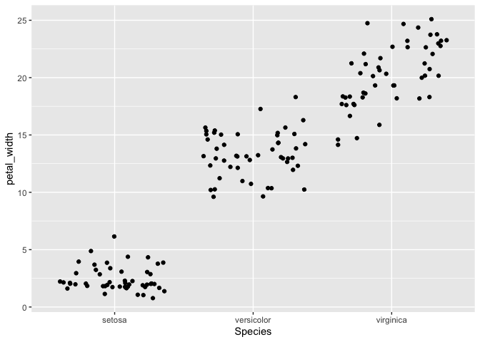
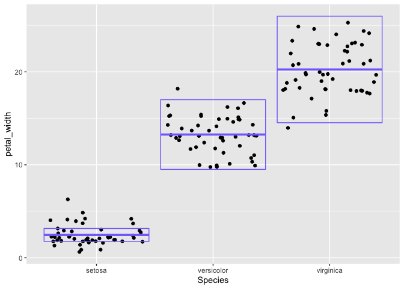
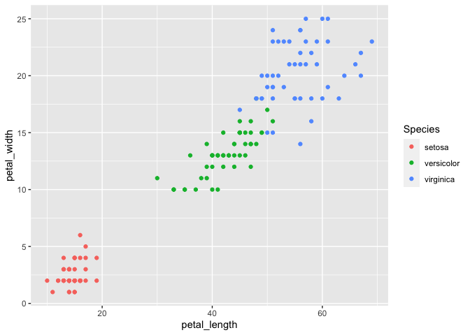

Lab 5
================
Ethan Dotzler
2/23/2021

This lab was about learning how to rename variables, create new
variables within a dataset, summarize a dataset in general and by
groups, and to visualize relationships between variables.

## Load Packages

``` r
library(tidyverse) 
```

    ## ── Attaching packages ─────────────────────────────────────── tidyverse 1.3.0 ──

    ## ✓ ggplot2 3.3.3     ✓ purrr   0.3.4
    ## ✓ tibble  3.0.5     ✓ dplyr   1.0.3
    ## ✓ tidyr   1.1.2     ✓ stringr 1.4.0
    ## ✓ readr   1.4.0     ✓ forcats 0.5.0

    ## ── Conflicts ────────────────────────────────────────── tidyverse_conflicts() ──
    ## x dplyr::filter() masks stats::filter()
    ## x dplyr::lag()    masks stats::lag()

## Load Data

``` r
iris
```

    ##     Sepal.Length Sepal.Width Petal.Length Petal.Width    Species
    ## 1            5.1         3.5          1.4         0.2     setosa
    ## 2            4.9         3.0          1.4         0.2     setosa
    ## 3            4.7         3.2          1.3         0.2     setosa
    ## 4            4.6         3.1          1.5         0.2     setosa
    ## 5            5.0         3.6          1.4         0.2     setosa
    ## 6            5.4         3.9          1.7         0.4     setosa
    ## 7            4.6         3.4          1.4         0.3     setosa
    ## 8            5.0         3.4          1.5         0.2     setosa
    ## 9            4.4         2.9          1.4         0.2     setosa
    ## 10           4.9         3.1          1.5         0.1     setosa
    ## 11           5.4         3.7          1.5         0.2     setosa
    ## 12           4.8         3.4          1.6         0.2     setosa
    ## 13           4.8         3.0          1.4         0.1     setosa
    ## 14           4.3         3.0          1.1         0.1     setosa
    ## 15           5.8         4.0          1.2         0.2     setosa
    ## 16           5.7         4.4          1.5         0.4     setosa
    ## 17           5.4         3.9          1.3         0.4     setosa
    ## 18           5.1         3.5          1.4         0.3     setosa
    ## 19           5.7         3.8          1.7         0.3     setosa
    ## 20           5.1         3.8          1.5         0.3     setosa
    ## 21           5.4         3.4          1.7         0.2     setosa
    ## 22           5.1         3.7          1.5         0.4     setosa
    ## 23           4.6         3.6          1.0         0.2     setosa
    ## 24           5.1         3.3          1.7         0.5     setosa
    ## 25           4.8         3.4          1.9         0.2     setosa
    ## 26           5.0         3.0          1.6         0.2     setosa
    ## 27           5.0         3.4          1.6         0.4     setosa
    ## 28           5.2         3.5          1.5         0.2     setosa
    ## 29           5.2         3.4          1.4         0.2     setosa
    ## 30           4.7         3.2          1.6         0.2     setosa
    ## 31           4.8         3.1          1.6         0.2     setosa
    ## 32           5.4         3.4          1.5         0.4     setosa
    ## 33           5.2         4.1          1.5         0.1     setosa
    ## 34           5.5         4.2          1.4         0.2     setosa
    ## 35           4.9         3.1          1.5         0.2     setosa
    ## 36           5.0         3.2          1.2         0.2     setosa
    ## 37           5.5         3.5          1.3         0.2     setosa
    ## 38           4.9         3.6          1.4         0.1     setosa
    ## 39           4.4         3.0          1.3         0.2     setosa
    ## 40           5.1         3.4          1.5         0.2     setosa
    ## 41           5.0         3.5          1.3         0.3     setosa
    ## 42           4.5         2.3          1.3         0.3     setosa
    ## 43           4.4         3.2          1.3         0.2     setosa
    ## 44           5.0         3.5          1.6         0.6     setosa
    ## 45           5.1         3.8          1.9         0.4     setosa
    ## 46           4.8         3.0          1.4         0.3     setosa
    ## 47           5.1         3.8          1.6         0.2     setosa
    ## 48           4.6         3.2          1.4         0.2     setosa
    ## 49           5.3         3.7          1.5         0.2     setosa
    ## 50           5.0         3.3          1.4         0.2     setosa
    ## 51           7.0         3.2          4.7         1.4 versicolor
    ## 52           6.4         3.2          4.5         1.5 versicolor
    ## 53           6.9         3.1          4.9         1.5 versicolor
    ## 54           5.5         2.3          4.0         1.3 versicolor
    ## 55           6.5         2.8          4.6         1.5 versicolor
    ## 56           5.7         2.8          4.5         1.3 versicolor
    ## 57           6.3         3.3          4.7         1.6 versicolor
    ## 58           4.9         2.4          3.3         1.0 versicolor
    ## 59           6.6         2.9          4.6         1.3 versicolor
    ## 60           5.2         2.7          3.9         1.4 versicolor
    ## 61           5.0         2.0          3.5         1.0 versicolor
    ## 62           5.9         3.0          4.2         1.5 versicolor
    ## 63           6.0         2.2          4.0         1.0 versicolor
    ## 64           6.1         2.9          4.7         1.4 versicolor
    ## 65           5.6         2.9          3.6         1.3 versicolor
    ## 66           6.7         3.1          4.4         1.4 versicolor
    ## 67           5.6         3.0          4.5         1.5 versicolor
    ## 68           5.8         2.7          4.1         1.0 versicolor
    ## 69           6.2         2.2          4.5         1.5 versicolor
    ## 70           5.6         2.5          3.9         1.1 versicolor
    ## 71           5.9         3.2          4.8         1.8 versicolor
    ## 72           6.1         2.8          4.0         1.3 versicolor
    ## 73           6.3         2.5          4.9         1.5 versicolor
    ## 74           6.1         2.8          4.7         1.2 versicolor
    ## 75           6.4         2.9          4.3         1.3 versicolor
    ## 76           6.6         3.0          4.4         1.4 versicolor
    ## 77           6.8         2.8          4.8         1.4 versicolor
    ## 78           6.7         3.0          5.0         1.7 versicolor
    ## 79           6.0         2.9          4.5         1.5 versicolor
    ## 80           5.7         2.6          3.5         1.0 versicolor
    ## 81           5.5         2.4          3.8         1.1 versicolor
    ## 82           5.5         2.4          3.7         1.0 versicolor
    ## 83           5.8         2.7          3.9         1.2 versicolor
    ## 84           6.0         2.7          5.1         1.6 versicolor
    ## 85           5.4         3.0          4.5         1.5 versicolor
    ## 86           6.0         3.4          4.5         1.6 versicolor
    ## 87           6.7         3.1          4.7         1.5 versicolor
    ## 88           6.3         2.3          4.4         1.3 versicolor
    ## 89           5.6         3.0          4.1         1.3 versicolor
    ## 90           5.5         2.5          4.0         1.3 versicolor
    ## 91           5.5         2.6          4.4         1.2 versicolor
    ## 92           6.1         3.0          4.6         1.4 versicolor
    ## 93           5.8         2.6          4.0         1.2 versicolor
    ## 94           5.0         2.3          3.3         1.0 versicolor
    ## 95           5.6         2.7          4.2         1.3 versicolor
    ## 96           5.7         3.0          4.2         1.2 versicolor
    ## 97           5.7         2.9          4.2         1.3 versicolor
    ## 98           6.2         2.9          4.3         1.3 versicolor
    ## 99           5.1         2.5          3.0         1.1 versicolor
    ## 100          5.7         2.8          4.1         1.3 versicolor
    ## 101          6.3         3.3          6.0         2.5  virginica
    ## 102          5.8         2.7          5.1         1.9  virginica
    ## 103          7.1         3.0          5.9         2.1  virginica
    ## 104          6.3         2.9          5.6         1.8  virginica
    ## 105          6.5         3.0          5.8         2.2  virginica
    ## 106          7.6         3.0          6.6         2.1  virginica
    ## 107          4.9         2.5          4.5         1.7  virginica
    ## 108          7.3         2.9          6.3         1.8  virginica
    ## 109          6.7         2.5          5.8         1.8  virginica
    ## 110          7.2         3.6          6.1         2.5  virginica
    ## 111          6.5         3.2          5.1         2.0  virginica
    ## 112          6.4         2.7          5.3         1.9  virginica
    ## 113          6.8         3.0          5.5         2.1  virginica
    ## 114          5.7         2.5          5.0         2.0  virginica
    ## 115          5.8         2.8          5.1         2.4  virginica
    ## 116          6.4         3.2          5.3         2.3  virginica
    ## 117          6.5         3.0          5.5         1.8  virginica
    ## 118          7.7         3.8          6.7         2.2  virginica
    ## 119          7.7         2.6          6.9         2.3  virginica
    ## 120          6.0         2.2          5.0         1.5  virginica
    ## 121          6.9         3.2          5.7         2.3  virginica
    ## 122          5.6         2.8          4.9         2.0  virginica
    ## 123          7.7         2.8          6.7         2.0  virginica
    ## 124          6.3         2.7          4.9         1.8  virginica
    ## 125          6.7         3.3          5.7         2.1  virginica
    ## 126          7.2         3.2          6.0         1.8  virginica
    ## 127          6.2         2.8          4.8         1.8  virginica
    ## 128          6.1         3.0          4.9         1.8  virginica
    ## 129          6.4         2.8          5.6         2.1  virginica
    ## 130          7.2         3.0          5.8         1.6  virginica
    ## 131          7.4         2.8          6.1         1.9  virginica
    ## 132          7.9         3.8          6.4         2.0  virginica
    ## 133          6.4         2.8          5.6         2.2  virginica
    ## 134          6.3         2.8          5.1         1.5  virginica
    ## 135          6.1         2.6          5.6         1.4  virginica
    ## 136          7.7         3.0          6.1         2.3  virginica
    ## 137          6.3         3.4          5.6         2.4  virginica
    ## 138          6.4         3.1          5.5         1.8  virginica
    ## 139          6.0         3.0          4.8         1.8  virginica
    ## 140          6.9         3.1          5.4         2.1  virginica
    ## 141          6.7         3.1          5.6         2.4  virginica
    ## 142          6.9         3.1          5.1         2.3  virginica
    ## 143          5.8         2.7          5.1         1.9  virginica
    ## 144          6.8         3.2          5.9         2.3  virginica
    ## 145          6.7         3.3          5.7         2.5  virginica
    ## 146          6.7         3.0          5.2         2.3  virginica
    ## 147          6.3         2.5          5.0         1.9  virginica
    ## 148          6.5         3.0          5.2         2.0  virginica
    ## 149          6.2         3.4          5.4         2.3  virginica
    ## 150          5.9         3.0          5.1         1.8  virginica

``` r
iris <- as_tibble(iris) 
iris
```

    ## # A tibble: 150 x 5
    ##    Sepal.Length Sepal.Width Petal.Length Petal.Width Species
    ##           <dbl>       <dbl>        <dbl>       <dbl> <fct>  
    ##  1          5.1         3.5          1.4         0.2 setosa 
    ##  2          4.9         3            1.4         0.2 setosa 
    ##  3          4.7         3.2          1.3         0.2 setosa 
    ##  4          4.6         3.1          1.5         0.2 setosa 
    ##  5          5           3.6          1.4         0.2 setosa 
    ##  6          5.4         3.9          1.7         0.4 setosa 
    ##  7          4.6         3.4          1.4         0.3 setosa 
    ##  8          5           3.4          1.5         0.2 setosa 
    ##  9          4.4         2.9          1.4         0.2 setosa 
    ## 10          4.9         3.1          1.5         0.1 setosa 
    ## # … with 140 more rows

## Question 1

``` r
iris_new <- 
  rename( 
    iris, 
    sepal_length = Sepal.Length, 
    sepal_width = Sepal.Width, 
    petal_length = Petal.Length,
    petal_width = Petal.Width 
  )  

iris_new
```

    ## # A tibble: 150 x 5
    ##    sepal_length sepal_width petal_length petal_width Species
    ##           <dbl>       <dbl>        <dbl>       <dbl> <fct>  
    ##  1          5.1         3.5          1.4         0.2 setosa 
    ##  2          4.9         3            1.4         0.2 setosa 
    ##  3          4.7         3.2          1.3         0.2 setosa 
    ##  4          4.6         3.1          1.5         0.2 setosa 
    ##  5          5           3.6          1.4         0.2 setosa 
    ##  6          5.4         3.9          1.7         0.4 setosa 
    ##  7          4.6         3.4          1.4         0.3 setosa 
    ##  8          5           3.4          1.5         0.2 setosa 
    ##  9          4.4         2.9          1.4         0.2 setosa 
    ## 10          4.9         3.1          1.5         0.1 setosa 
    ## # … with 140 more rows

## Question 2

``` r
iris_numbers <- select(iris_new, sepal_length, sepal_width, petal_length, petal_width, Species)

iris_numbers 
```

    ## # A tibble: 150 x 5
    ##    sepal_length sepal_width petal_length petal_width Species
    ##           <dbl>       <dbl>        <dbl>       <dbl> <fct>  
    ##  1          5.1         3.5          1.4         0.2 setosa 
    ##  2          4.9         3            1.4         0.2 setosa 
    ##  3          4.7         3.2          1.3         0.2 setosa 
    ##  4          4.6         3.1          1.5         0.2 setosa 
    ##  5          5           3.6          1.4         0.2 setosa 
    ##  6          5.4         3.9          1.7         0.4 setosa 
    ##  7          4.6         3.4          1.4         0.3 setosa 
    ##  8          5           3.4          1.5         0.2 setosa 
    ##  9          4.4         2.9          1.4         0.2 setosa 
    ## 10          4.9         3.1          1.5         0.1 setosa 
    ## # … with 140 more rows

``` r
iris_cm <-
  mutate( 
    iris_numbers, 
    sepal_length = 10*sepal_length, 
    sepal_width = 10*sepal_width, 
    petal_length = 10*petal_length, 
    petal_width = 10*petal_width
  ) 

iris_cm
```

    ## # A tibble: 150 x 5
    ##    sepal_length sepal_width petal_length petal_width Species
    ##           <dbl>       <dbl>        <dbl>       <dbl> <fct>  
    ##  1           51          35           14           2 setosa 
    ##  2           49          30           14           2 setosa 
    ##  3           47          32           13           2 setosa 
    ##  4           46          31           15           2 setosa 
    ##  5           50          36           14           2 setosa 
    ##  6           54          39           17           4 setosa 
    ##  7           46          34           14           3 setosa 
    ##  8           50          34           15           2 setosa 
    ##  9           44          29           14           2 setosa 
    ## 10           49          31           15           1 setosa 
    ## # … with 140 more rows

## Question 3

``` r
iris_area <- mutate(iris_cm, sepal_area = sepal_length * sepal_width, 
                    petal_area = petal_length * petal_width) %>%
  select(petal_area, sepal_area, Species) 

iris_area
```

    ## # A tibble: 150 x 3
    ##    petal_area sepal_area Species
    ##         <dbl>      <dbl> <fct>  
    ##  1         28       1785 setosa 
    ##  2         28       1470 setosa 
    ##  3         26       1504 setosa 
    ##  4         30       1426 setosa 
    ##  5         28       1800 setosa 
    ##  6         68       2106 setosa 
    ##  7         42       1564 setosa 
    ##  8         30       1700 setosa 
    ##  9         28       1276 setosa 
    ## 10         15       1519 setosa 
    ## # … with 140 more rows

## Question 4

``` r
count(iris_cm) 
```

    ## # A tibble: 1 x 1
    ##       n
    ##   <int>
    ## 1   150

``` r
summarize(
  iris_cm,
  sample_size = n(), 
  mean = mean(sepal_length), 
  max = max(sepal_length), 
  min = min(sepal_length), 
  range = max - min,
  median = median(sepal_length), 
  q1 = quantile(sepal_length, probs = 0.25), 
  q3 = quantile(sepal_length, probs = 0.75),
  iqr = IQR(sepal_length)
  )
```

    ## # A tibble: 1 x 9
    ##   sample_size  mean   max   min range median    q1    q3   iqr
    ##         <int> <dbl> <dbl> <dbl> <dbl>  <dbl> <dbl> <dbl> <dbl>
    ## 1         150  58.4    79    43    36     58    51    64    13

## Question 5

``` r
iris_sum <-
  iris_cm %>%
  group_by(Species) %>%
  summarize(
    sample_size = n(),
    mean_w = mean(petal_width),
    str_dev = sd(petal_width),
    var = var(petal_width),
    sem = mean(petal_width) / sqrt(n()),
    ci_upper = mean_w + 2 * sem,
    ci_lower = mean_w - 2 * sem
  )

iris_sum
```

    ## # A tibble: 3 x 8
    ##   Species    sample_size mean_w str_dev   var   sem ci_upper ci_lower
    ## * <fct>            <int>  <dbl>   <dbl> <dbl> <dbl>    <dbl>    <dbl>
    ## 1 setosa              50   2.46    1.05  1.11 0.348     3.16     1.76
    ## 2 versicolor          50  13.3     1.98  3.91 1.88     17.0      9.51
    ## 3 virginica           50  20.3     2.75  7.54 2.87     26.0     14.5

## Question 6

``` r
ggplot(data = iris_cm) + 
  geom_jitter(mapping = aes(x = Species, y = petal_width)) 
```

<!-- -->

## Question 7

``` r
ggplot(data = iris_cm) + 
  geom_jitter(mapping = aes(x = Species, y = petal_width)) + 
  geom_crossbar( 
    data = iris_sum, 
    mapping = aes(x = Species, y = mean_w, ymax = ci_upper, ymin = ci_lower), 
    color = "lightslateblue"
    )
```

<!-- -->

## Question 8

``` r
ggplot(data = iris_cm) + 
  geom_point(mapping = aes(x = petal_length, y = petal_width, color = Species))
```

<!-- -->

## Session Info

Here is my session info:

``` r
sessioninfo::session_info()
```

    ## ─ Session info ───────────────────────────────────────────────────────────────
    ##  setting  value                       
    ##  version  R version 4.0.3 (2020-10-10)
    ##  os       macOS Big Sur 10.16         
    ##  system   x86_64, darwin17.0          
    ##  ui       X11                         
    ##  language (EN)                        
    ##  collate  en_US.UTF-8                 
    ##  ctype    en_US.UTF-8                 
    ##  tz       America/Chicago             
    ##  date     2021-05-04                  
    ## 
    ## ─ Packages ───────────────────────────────────────────────────────────────────
    ##  package     * version date       lib source        
    ##  assertthat    0.2.1   2019-03-21 [1] CRAN (R 4.0.2)
    ##  backports     1.2.1   2020-12-09 [1] CRAN (R 4.0.2)
    ##  broom         0.7.3   2020-12-16 [1] CRAN (R 4.0.2)
    ##  cellranger    1.1.0   2016-07-27 [1] CRAN (R 4.0.2)
    ##  cli           2.2.0   2020-11-20 [1] CRAN (R 4.0.2)
    ##  colorspace    2.0-0   2020-11-11 [1] CRAN (R 4.0.2)
    ##  crayon        1.3.4   2017-09-16 [1] CRAN (R 4.0.2)
    ##  DBI           1.1.1   2021-01-15 [1] CRAN (R 4.0.3)
    ##  dbplyr        2.0.0   2020-11-03 [1] CRAN (R 4.0.2)
    ##  digest        0.6.27  2020-10-24 [1] CRAN (R 4.0.2)
    ##  dplyr       * 1.0.3   2021-01-15 [1] CRAN (R 4.0.3)
    ##  ellipsis      0.3.1   2020-05-15 [1] CRAN (R 4.0.2)
    ##  evaluate      0.14    2019-05-28 [1] CRAN (R 4.0.1)
    ##  fansi         0.4.2   2021-01-15 [1] CRAN (R 4.0.3)
    ##  farver        2.0.3   2020-01-16 [1] CRAN (R 4.0.2)
    ##  forcats     * 0.5.0   2020-03-01 [1] CRAN (R 4.0.2)
    ##  fs            1.5.0   2020-07-31 [1] CRAN (R 4.0.2)
    ##  generics      0.1.0   2020-10-31 [1] CRAN (R 4.0.2)
    ##  ggplot2     * 3.3.3   2020-12-30 [1] CRAN (R 4.0.2)
    ##  glue          1.4.2   2020-08-27 [1] CRAN (R 4.0.2)
    ##  gtable        0.3.0   2019-03-25 [1] CRAN (R 4.0.2)
    ##  haven         2.3.1   2020-06-01 [1] CRAN (R 4.0.2)
    ##  hms           1.0.0   2021-01-13 [1] CRAN (R 4.0.2)
    ##  htmltools     0.5.1   2021-01-12 [1] CRAN (R 4.0.2)
    ##  httr          1.4.2   2020-07-20 [1] CRAN (R 4.0.2)
    ##  jsonlite      1.7.2   2020-12-09 [1] CRAN (R 4.0.2)
    ##  knitr         1.30    2020-09-22 [1] CRAN (R 4.0.2)
    ##  labeling      0.4.2   2020-10-20 [1] CRAN (R 4.0.2)
    ##  lifecycle     0.2.0   2020-03-06 [1] CRAN (R 4.0.2)
    ##  lubridate     1.7.9.2 2020-11-13 [1] CRAN (R 4.0.2)
    ##  magrittr      2.0.1   2020-11-17 [1] CRAN (R 4.0.2)
    ##  modelr        0.1.8   2020-05-19 [1] CRAN (R 4.0.2)
    ##  munsell       0.5.0   2018-06-12 [1] CRAN (R 4.0.2)
    ##  pillar        1.4.7   2020-11-20 [1] CRAN (R 4.0.2)
    ##  pkgconfig     2.0.3   2019-09-22 [1] CRAN (R 4.0.2)
    ##  purrr       * 0.3.4   2020-04-17 [1] CRAN (R 4.0.2)
    ##  R6            2.5.0   2020-10-28 [1] CRAN (R 4.0.2)
    ##  Rcpp          1.0.6   2021-01-15 [1] CRAN (R 4.0.3)
    ##  readr       * 1.4.0   2020-10-05 [1] CRAN (R 4.0.2)
    ##  readxl        1.3.1   2019-03-13 [1] CRAN (R 4.0.2)
    ##  reprex        0.3.0   2019-05-16 [1] CRAN (R 4.0.2)
    ##  rlang         0.4.10  2020-12-30 [1] CRAN (R 4.0.2)
    ##  rmarkdown     2.6     2020-12-14 [1] CRAN (R 4.0.2)
    ##  rstudioapi    0.13    2020-11-12 [1] CRAN (R 4.0.2)
    ##  rvest         0.3.6   2020-07-25 [1] CRAN (R 4.0.2)
    ##  scales        1.1.1   2020-05-11 [1] CRAN (R 4.0.2)
    ##  sessioninfo   1.1.1   2018-11-05 [1] CRAN (R 4.0.2)
    ##  stringi       1.5.3   2020-09-09 [1] CRAN (R 4.0.2)
    ##  stringr     * 1.4.0   2019-02-10 [1] CRAN (R 4.0.2)
    ##  tibble      * 3.0.5   2021-01-15 [1] CRAN (R 4.0.3)
    ##  tidyr       * 1.1.2   2020-08-27 [1] CRAN (R 4.0.2)
    ##  tidyselect    1.1.0   2020-05-11 [1] CRAN (R 4.0.2)
    ##  tidyverse   * 1.3.0   2019-11-21 [1] CRAN (R 4.0.2)
    ##  utf8          1.1.4   2018-05-24 [1] CRAN (R 4.0.2)
    ##  vctrs         0.3.6   2020-12-17 [1] CRAN (R 4.0.2)
    ##  withr         2.3.0   2020-09-22 [1] CRAN (R 4.0.2)
    ##  xfun          0.20    2021-01-06 [1] CRAN (R 4.0.2)
    ##  xml2          1.3.2   2020-04-23 [1] CRAN (R 4.0.2)
    ##  yaml          2.2.1   2020-02-01 [1] CRAN (R 4.0.2)
    ## 
    ## [1] /Library/Frameworks/R.framework/Versions/4.0/Resources/library
